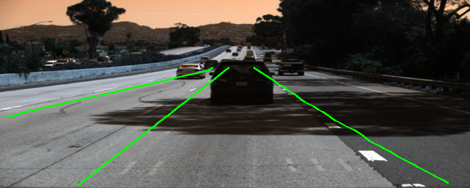
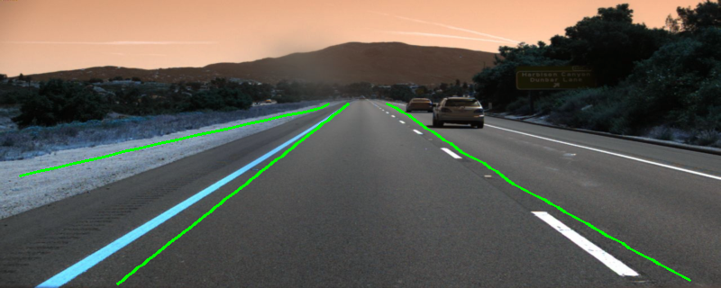

# Lane2Seq: Unified Lane Detection with Transformers

Lane2Seq is a reimplementation of **Lane2Seq: Towards Unified Lane Detection via Sequence Generation**, a novel framework for lane detection. Instead of relying on traditional task-specific approaches like segmentation or curve fitting, Lane2Seq unifies these methods by casting lane detection as a sequence generation task. This avoids the need for complex task-specific head networks and loss functions typical of older methods. 

---

## ✨ Features

- **Unified Architecture:** A single transformer-based encoder-decoder model handles multiple lane representations.  
- **Sequence Generation:** Lane detection is framed as a sequence-to-sequence task, generating a series of tokens that describe lane geometry.  
- **ViT Encoder:** Uses a Vision Transformer (ViT) encoder pre-trained with Masked Autoencoders (MAE) for robust image feature extraction.  
- **Format Flexibility:** Supports three lane representations—Segmentation, Anchor, and Parameter formats—controlled by a format-specific input prompt.  
- **Reproducible Pipeline:** Includes complete training, inference, and evaluation scripts for the TuSimple dataset.  

---

## ⚙️ Getting Started


## Installation

To install the required dependencies, run:

```bash
pip install torch torchvision numpy pyyaml tqdm transformers safetensors opencv-python shapely Pillow
```

## Usage

### 1. Configuration
Edit `configs/config.yaml` to set paths, hyperparameters, and lane format. Key parameters include:

- `data_path`: Path to the TuSimple dataset
- `encoder_checkpoint`: Pre-trained ViT checkpoint
- `format_type`: Choose between `segmentation`, `anchor`, or `parameter`

### 2. Training
Run the standard training script:

```bash
python train1.py
```


### 3. Inference
Run the model on the test set:

```bash
python inference.py
```

Results will be saved as JSON files and visualizations in the folder specified in `config.yaml`.

### 4. Evaluation
Compute metrics such as Precision, Recall, and F1-score:

```bash
python evaluation.py
```

## Results
After 15 epochs of supervised training on the TuSimple benchmark using the anchor format, the model achieves:

- **F1-score**: 32.59%
- **Precision**: 39.13%
- **Recall**: 28.97%

### Example Predictions
| Predicted Lanes |
|-----------------|
|  |
|  |


These visual results demonstrate the model's ability to detect multiple lanes under diverse driving conditions.

## References
- **Lane2Seq Paper**: Hu, X., Ma, L., Wei, H., Xie, D., & Liang, X. (2020). *Lane2Seq: Towards Unified Lane Detection via Sequence Generation*. [arXiv:2012.01629](https://arxiv.org/abs/2012.01629)
- **TuSimple Lane Detection Benchmark**: [https://github.com/TuSimple/tusimple-benchmark](https://github.com/TuSimple/tusimple-benchmark)


